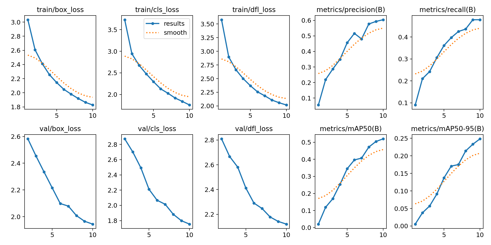
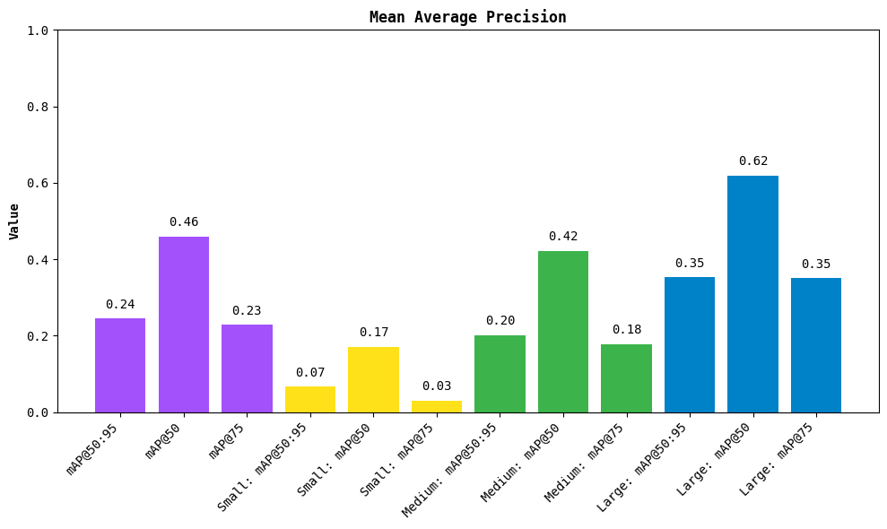

# CSC173 Deep Computer Vision Progress Report

**Student:** Shir Keilah T. Connor (2022-5474)
**Date:** December 15, 2025
**Repository:** [https://github.com/kunnow/CSC173-DeepCV-Connor](https://github.com/kunnow/CSC173-DeepCV-Connor)

## 📊 Current Status

| Milestone              | Status        | Notes                                                                |
| ---------------------- | ------------- | -------------------------------------------------------------------- |
| Dataset Preparation    | ✅ Completed   | Roboflow pothole dataset prepared and exported for YOLO training     |
| Initial Model Training | ✅ Completed   | Initial YOLO training completed and best model saved (`best.pt`)     |
| Baseline Evaluation    | ✅ Completed   | Preliminary evaluation performed after initial training              |
| Deployment Development | ✅ Completed   | Flask-based inference application implemented                        |
| Extended Fine-tuning   | ⏳ In Progress | Additional training planned to further improve detection performance |

## 1. Dataset Progress

* **Dataset source:** Roboflow Universe – *New Pothole Detection* dataset
* **Classes implemented:** 1 class — *Pothole*
* **Dataset management:** Roboflow (annotation, versioning, export)
* **Train / Validation / Test split:** Managed through Roboflow YOLO export
* **Preprocessing and augmentation:**

  * Image resizing to YOLO-compatible input resolution
  * Normalization
  * Built-in and custom augmentations (flips, rotations, brightness changes, blur, and environmental variations)

**Sample data preview:**

## 2. Model Training Progress

* YOLO-based object detection model trained using the prepared Roboflow dataset
* Initial training phase completed, producing a trained weights file (`best.pt`)
* Baseline performance evaluated to establish reference metrics prior to extended fine-tuning
* Observed early convergence with room for improvement through longer training and hyperparameter adjustment

**Training curves (initial phase):**

**Baseline metrics (after initial training):**

| Metric    | Training | Validation |
| --------- | -------- | ---------- |
| Loss      | 0.45     | 0.62       |
| mAP@0.5   | 78%      | 72%        |
| Precision | 0.81     | 0.75       |
| Recall    | 0.73     | 0.68       |

These results indicate reasonable baseline performance for a single-class detection task and justify further fine-tuning.

## 3. Deployment & Application Progress

A real-time pothole detection application has been successfully implemented using Flask.

**Key features:**

* Loads the trained YOLO model weights (`best.pt`)
* Performs inference on video input (`demo.mp4`)
* Draws bounding boxes and labels using the *Supervision* library
* Streams annotated video frames through a web interface (`/video_feed`)
* Exposes a REST endpoint (`/detection_count`) to report the number of detected potholes per frame

This deployment demonstrates end-to-end integration from dataset preparation and model training to real-world inference and visualization.

## 4. Challenges Encountered and Mitigations

| Issue                  | Status     | Mitigation / Action Taken                   |
| ---------------------- | ---------- | ------------------------------------------- |
| GPU memory limitations | ✅ Resolved | Reduced batch size during training          |
| Class imbalance        | ⏳ Ongoing  | Dataset-level balancing and loss weighting  |
| Inference performance  | ⏳ Ongoing  | Planned optimizations and model fine-tuning |

## 5. Next Steps (Before Final Submission)

* [ ] Complete extended model fine-tuning
* [ ] Perform hyperparameter optimization
* [ ] Compare fine-tuned model against baseline results
* [ ] Improve deployment performance and UI polish
* [ ] Record a 5-minute demonstration video
* [ ] Finalize README.md with methodology, results, and analysis

